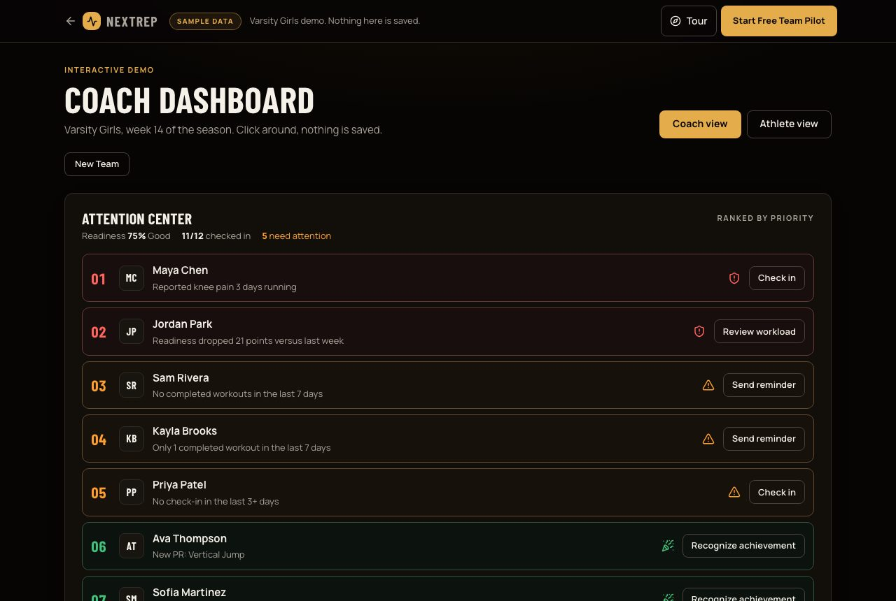
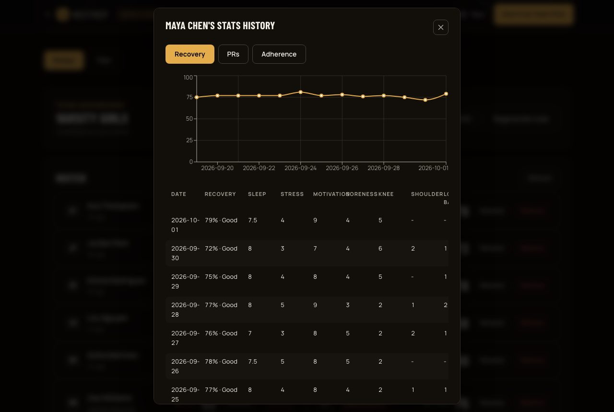
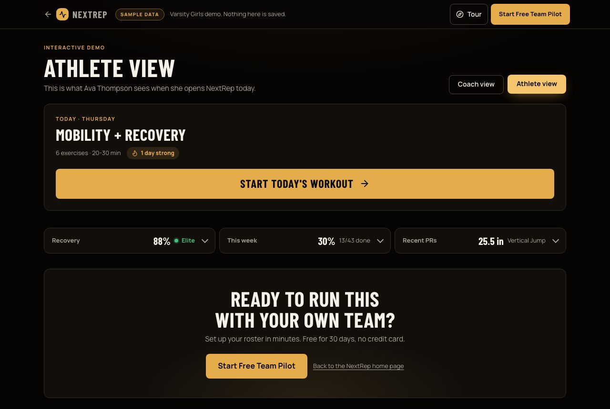
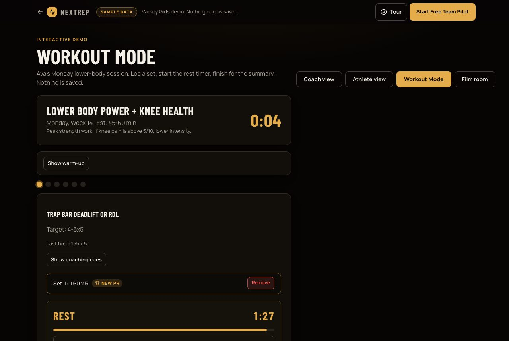
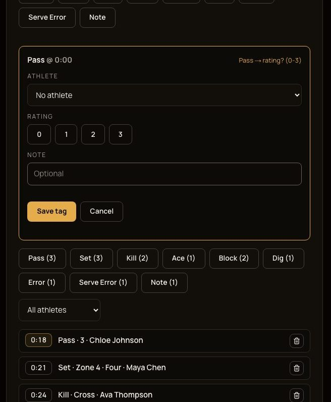

# NextRep

NextRep is a Next.js and TypeScript athlete training-and-recovery operating system built for volleyball teams.

## Live Demo

- App: https://volleyball-tracker-beta.vercel.app
- Try it without an account: https://volleyball-tracker-beta.vercel.app/demo
  (a sample team with a roster, readiness, the Attention Center and an athlete view; nothing is saved)

## Screenshots

From the public demo at `/demo` (sample team, no real athletes):

| Coach dashboard and Attention Center | Athlete drill-down | Athlete home |
| --- | --- | --- |
|  |  |  |
| **Workout Mode** | **Film room** | |
|  |  | |

The Workout Mode and film room demo tabs come from #39.

Regenerate them with `node scripts/capture-readme-screenshots.mjs` against a running build.

## Features

- 20-week volleyball workout tracker
- Weekly training phases
- Workout completion tracking
- Recovery score
- Rule-based recovery recommendations
- Stats history
- Progress graphs
- Exercise library
- Calendar and training load preview
- Account sign-up/login and per-user cloud data (Supabase)
- Workout Mode: start a session, log sets with a rest timer, get a finish-of-workout summary
- Coach/Team layer: create or join a team by invite code, coaches get a
  read-only roster view with recovery scores, check-in flags, and a
  drill-down into each athlete's full stats history
- Phase-based 20-week program (Foundation/Build/Power/Taper) with real
  exercise variety per phase, not a single template repeated for 20 weeks
- Exercise substitution: swap any exercise for a curated alternative or
  another exercise in the same category, remembered across sessions
- Exercise library tagged by Beginner/Intermediate/Advanced, including
  hip-abduction, single-leg balance, and landing-mechanics work
- Team film review: coaches link YouTube (or other) game film to the team,
  tag plays by type at a timestamp, and athletes can jump straight to a
  tagged moment
- Film tag details: every tag can record the athlete, pass rating, set zone
  and type, block outcome or attack direction. Coaches can tag with the
  keyboard (one key per tag type, then a detail key) or by voice
  ("Maya pass two") through the browser's Web Speech API
- Coach program builder: coaches build their own repeating week and assign it
  to the whole team, a group of athletes, or one athlete (the most specific
  assignment wins)
- Timed exercises: planks, holds and stretches log seconds with a hold timer
  instead of reps
- Attention Center: the coach dashboard ranks who needs a look today (pain
  streaks, readiness drops, missed workouts, new PRs)
- Team calendar: coaches add practices, matches, tournaments, travel and
  testing days the whole team sees
- Installable PWA: add to home screen, offline fallback page, and a service
  worker that only caches static assets
- Public demo at `/demo`: explore the real coach and athlete UI with sample
  data, no sign-up

## Tech Stack

- Next.js (App Router)
- TypeScript
- React
- Recharts
- CSS
- Supabase (Auth + Postgres)

## Setup

1. `npm install`
2. Create a Supabase project, then create `.env.local` with:
   ```
   NEXT_PUBLIC_SUPABASE_URL=your-project-url
   NEXT_PUBLIC_SUPABASE_ANON_KEY=your-anon-or-publishable-key
   ```
3. Run every file in `supabase/`, once each, in your project's SQL Editor, in this order, to create the tables, row-level security policies, and constraints: `schema.sql`, `schema_v18_5.sql`, `schema_v19.sql`, `schema_v20_teams.sql`, `schema_v21_substitutions.sql`, `schema_v22_profiles.sql`, `schema_v23_team_management.sql`, `schema_v24_performance_profiles.sql`, `schema_v25_removal_notices.sql`, `schema_v26_multi_team_coach.sql`, `schema_v27_team_plan_tier.sql`, `schema_v28_team_exercise_defaults.sql`, `schema_v29_team_day_overrides.sql`, `schema_v30_workout_active_time.sql`, `schema_v31_readiness_expansion.sql`, `schema_v32_workout_rpe.sql`, `schema_v33_team_calendar.sql`, `schema_v34_profile_onboarding.sql`, `schema_v35_team_film.sql`, `schema_v36_film_tag_details.sql`, `schema_v40_pilot_applications.sql`, `schema_v41_team_member_names.sql`, `schema_v42_workout_set_seconds.sql`, `schema_v43_team_programs.sql`. (There are no v37 to v39 files.)
4. `npm run dev`

### Optional environment variables

Everything below is optional. The app works without them, and each feature
stays off until its variables are set.

| Variable | What it does |
| --- | --- |
| `NEXT_PUBLIC_SITE_URL` | Canonical public origin used for metadata, the sitemap and robots.txt. Defaults to `https://volleyball-tracker-beta.vercel.app`; set it when a custom domain is attached. |
| `NOTION_TOKEN` | Notion integration token for the personal Training Log sync (`/api/notion-sync`). Server-only. |
| `NOTION_TRAINING_LOG_DATA_SOURCE_ID` | The Notion data source that finished workouts and check-ins are written to. |
| `NOTION_SYNC_USER_ID` | The one Supabase user ID whose data is synced. The sync is a no-op for every other user. |

The Notion sync only runs when all three `NOTION_*` variables are set.

Run the unit tests with `npm test`; see [TESTING.md](TESTING.md) for what is covered.

For how the app is put together (data model, row-level security, program resolution and the main tradeoffs), see [docs/ARCHITECTURE.md](docs/ARCHITECTURE.md).

## Purpose

This project was built to help track volleyball performance, jump training, recovery, and consistency while also serving as a full-stack-ready portfolio project.
