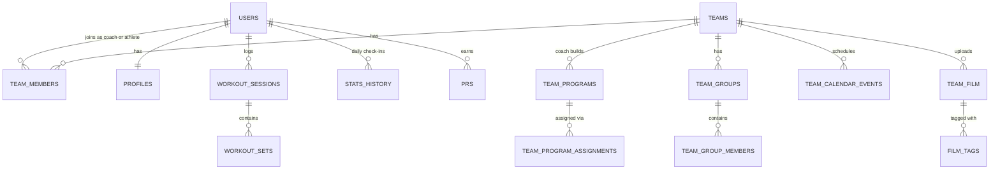

# NextRep architecture

This page explains how NextRep is put together and why. It is written so you
can explain the design out loud: what the pieces are, how athlete data stays
private, and what was traded away to keep it simple.

## The short version

NextRep is a Next.js (App Router) app written in TypeScript. The browser talks
**directly to Supabase** (hosted Postgres plus auth) with the user's own login
token. There is almost no custom backend. Postgres **row-level security (RLS)**
decides, row by row, what each signed-in user may read or write, so a bug in
the React code cannot leak another athlete's data.

```
Browser (React, hooks in src/hooks)
   │  supabase-js with the user's JWT
   ▼
Supabase Postgres ── RLS policies run on every query ── auth.uid() = the caller
   ▲
   │  same JWT, read from cookies
Next.js server (src/proxy.ts, src/app/api/*): login redirects, /api/pilot, /api/notion-sync
```

The few server routes (`/api/pilot`, `/api/notion-sync`) also use the anon key
and the caller's session, never a service-role key, so RLS applies there too.

## Data model

Everything belongs either to **one user** or to **one team**.



**Per-athlete tables** (each row has a `user_id`):

| Table | What it holds |
| --- | --- |
| `profiles` | Name, position, onboarding answers |
| `workout_sessions`, `workout_sets` | Workout Mode: a session with start/end and active time, and every set logged (weight, reps or seconds) |
| `exercise_checks`, `workout_logs`, `workout_notes` | The simpler checklist-style plan view |
| `latest_stats`, `stats_history` | Daily readiness check-ins (sleep, soreness, energy, pain) |
| `prs` | Personal records |
| `calendar_events` | The athlete's own calendar (games, practices) |
| `exercise_substitutions` | "I always swap exercise X for Y" |
| `performance_profiles` | Vertical jump and other test results |

**Per-team tables** (each row has a `team_id`):

| Table | What it holds |
| --- | --- |
| `teams`, `team_members` | The team, its invite code, plan tier, and who is a `coach` or `athlete` |
| `team_programs` | A coach-built repeating week, stored as `jsonb` in `days` |
| `team_groups`, `team_group_members` | Named groups of athletes (for example "Middles") |
| `team_program_assignments` | Which program goes to the team, a group, or one athlete |
| `team_exercise_defaults`, `team_day_overrides` | Older, lighter ways to customize the recommended plan |
| `team_calendar_events` | Practices, matches, tournaments, travel, testing |
| `team_film`, `film_tags` | Game film links and timestamped tags (who made the play, pass rating, set zone, ...) |

The recommended 20-week plan is not in the database at all. It is static
TypeScript in `src/data/workoutPlan.ts` and `src/data/exercises.ts`, shipped
with the app.

Schema changes are numbered SQL files in `supabase/` (`schema_v20_teams.sql`,
..., `schema_v43_team_programs.sql`). Each one is safe to re-run
(`create table if not exists`, `drop policy if exists` then `create policy`).

## How RLS protects athlete data

RLS is a Postgres feature: you turn it on for a table, and then **every**
query against that table is filtered by the policies you write. Supabase
passes the caller's identity into Postgres, available as `auth.uid()`.

### Rule 1: your own rows

Every per-athlete table starts with the same policy:

```sql
create policy "own rows" on public.workout_sessions
  for all using (auth.uid() = user_id) with check (auth.uid() = user_id);
```

`using` filters what you can see, update or delete. `with check` stops you from
inserting a row with someone else's `user_id`. Without a matching policy, a
`select` returns zero rows. It does not raise an error.

### Rule 2: a coach can read their own athletes

Two helper functions in `schema_v20_teams.sql` answer "is the caller a coach?":

```sql
-- Is the caller a coach of this team?
create function public.is_team_coach(p_team_id uuid) returns boolean
language sql security definer stable as $$
  select exists (
    select 1 from public.team_members
    where team_id = p_team_id and user_id = auth.uid() and role = 'coach'
  );
$$;

-- Is the caller a coach of a team this athlete is on?
create function public.is_caller_coach_of(p_user_id uuid) returns boolean ...
```

They are used two ways:

- **Team tables** (programs, groups, calendar, film):
  `for all using (public.is_team_coach(team_id))`. Only that team's coach can
  write. Any member of the team can read.
- **Athlete tables** (check-ins, sessions, PRs, profiles): a second, read-only
  policy, `for select using (public.is_caller_coach_of(user_id))`. A coach
  can **see** their roster's data but can never edit it. A coach of a
  different team sees nothing.

Why `security definer`? The function itself reads `team_members`, and
`team_members` has its own RLS. A policy that queried a table whose policy
queried back would recurse forever. `security definer` runs the function with
its owner's rights, so the membership check skips RLS. It is still safe
because the function only ever answers a yes/no question about `auth.uid()`,
which the caller cannot fake.

### Rule 3: sensitive writes go through functions

There is no `insert` policy on `teams` or `team_members`. Creating a team
(`create_team`) and joining one with an invite code (`join_team`) are
`security definer` functions that check the code and insert the membership
themselves. A client cannot just insert `role = 'coach'` for itself.

Some write policies also check relationships, not just roles. For example, a
coach can only add someone to a group if that person is an athlete on the
same team, and can only assign a program that belongs to the same team (see
`schema_v43_team_programs.sql`).

## Why the logic lives in `src/lib`

The rules that matter are pure TypeScript functions in `src/lib`: readiness
scoring (`recovery.ts`), what the Attention Center flags
(`attentionCenter.ts`), which program an athlete follows
(`customProgram.ts`, `programResolution.ts`), film hotkeys and voice parsing
(`filmHotkeys.ts`, `filmVoice.ts`).

"Pure" means: data in, answer out. No React, no Supabase, no clock unless
it is passed in. That gives three things:

1. **Fast, honest tests.** Vitest runs about 400 tests in plain Node in about a
   second, with no database and no browser (see [TESTING.md](../TESTING.md)).
2. **Thin hooks.** A hook in `src/hooks` fetches rows, calls a `src/lib`
   function, and stores the result. When something is wrong, it is usually
   either "the query returned the wrong rows" (check RLS and filters) or "the
   function computed the wrong answer" (write a failing test).
3. **The demo is free.** `/demo` feeds sample data from `src/data/demoData.ts`
   into the same components and the same `src/lib` functions, so the demo
   cannot drift from the real app.

## How an athlete's program is chosen

When an athlete opens the app, `TrackerContext` loads their team's
assignments and their group memberships, then calls
`pickAssignedProgramId` (`src/lib/customProgram.ts`):

1. **Athlete**: an assignment made to this athlete by name wins.
2. **Group**: otherwise, a program assigned to any group they are in. If
   they are in more than one assigned group, the most recently changed
   assignment wins.
3. **Team**: otherwise, the team-wide program.
4. **Nothing assigned**: the recommended 20-week plan from
   `src/data/workoutPlan.ts`.

Unique indexes in `schema_v43` guarantee at most one team-wide assignment,
one per group, and one per athlete, so each step has at most one answer.

Then `resolveWorkoutDays` (`src/lib/programResolution.ts`) applies the
athlete's personal exercise substitutions on top. On the recommended plan it
also applies the team's older customizations (a full day edit on the paid
tier, per-exercise defaults on the pilot tier) before the athlete's swaps.

## Three tradeoffs

### 1. The browser queries Postgres directly; RLS is the security boundary

**Chosen:** React hooks call Supabase directly. No REST API sits in between.

**Gained:** far less code. Adding a feature is a table, a policy and a hook,
not a table plus endpoints plus DTOs. Access rules live in one place (the
database) and protect every client, including ones that do not exist yet.

**Given up:** the policies *are* the security model, and they are SQL with no
automated tests yet (TESTING.md lists this as not covered). A wrong policy
leaks data, and nothing catches it before review. Queries are also spread
across many hooks instead of one API layer, which is why
`TrackerContext.tsx` has grown large.

### 2. Coach programs are a `jsonb` column, not normalized tables

**Chosen:** a program's whole week (days, exercises, sets, reps, seconds) is
one `jsonb` value in `team_programs.days`, parsed and validated by
`parseProgramDays` and `validateProgram`.

**Gained:** the builder saves a program in one write, the shape matches the
TypeScript types one-to-one, and changing the shape needs no migration.

**Given up:** Postgres cannot enforce the inner structure or answer questions
like "which programs use Box Jumps?" with a plain `where`. Validation lives in
TypeScript, so a bad row written outside the app would only be caught when it
is read.

### 3. Program resolution runs in the client, not in the database

**Chosen:** "which program is this athlete on, and which week?" is computed
in the browser (`pickAssignedProgramId`, and the current week is UI state in
`TrackerContext`).

**Gained:** it is a small pure function with unit tests, and it reuses the
same code path as the demo.

**Given up:** the database does not know what each athlete was *supposed* to
do on a given day. That is why the Attention Center's "missed workouts"
signal is a proxy (fewer than 2 sessions in 7 days) rather than "missed an
assigned day". Fixing that means persisting a program start date or current
week per athlete on the server.
